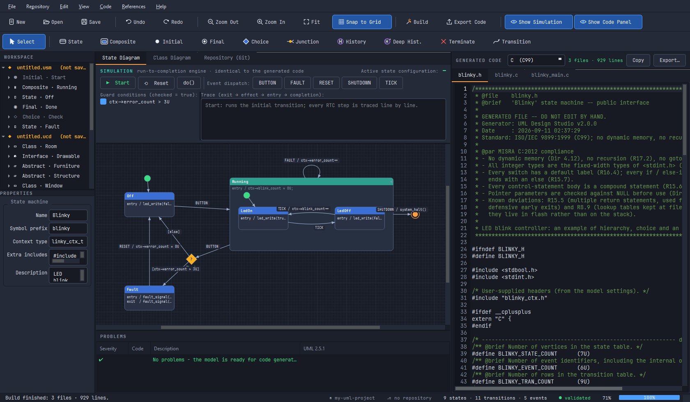
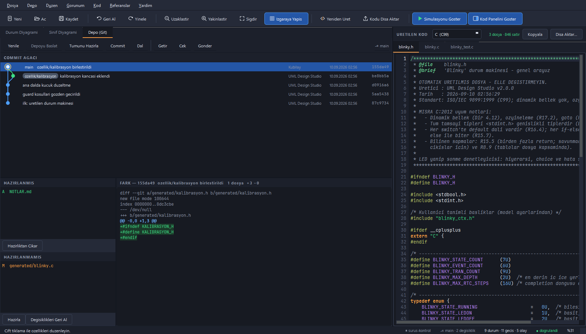

# UML Design Studio

UML 2.5.1 **durum makinesi** ve **sınıf diyagramı** çizip, onlardan gömülü
hedefler için **MISRA gözetilerek üretilmiş C11 / C++11 kodu ve çalışan bir
MCU tümleştirme örneği** üreten masaüstü tasarım aracı (PyQt6).



* **Açılışta çalışma alanı sorulur** — modelin ve üretilen kodun tutulacağı
  klasör; Git paneli de bu klasör üzerinde çalışır
* **Açılışta örnek model yüklenmez** — tuvalde boş bir şablon (`Start → Idle`)
  bulunur. Hazır örnekler yalnızca **File → Sample State Machine** /
  **Sample Class Diagram** ile gelir; böylece çalışma alanınızda olmayan bir
  model kendi projenizin parçasıymış gibi görünmez
* **Üst şerit** — birinci satırda dosya/düzen/görünüm/üretim, ikinci satırda
  etkin diyagram kipinin **araçları**; hemen altında kip sekmeleri
* **Sol panel** — **WORKSPACE** ağacı (çalışma alanındaki bütün modeller ve
  her modelin içeriği: durumlar, geçişler, sınıflar, öznitelikler, işlemler,
  ilişkiler) ve **PROPERTIES**. Ayrı bir "model ağacı" paneli **yoktur**;
  workspace ağacı zaten aynı bilgiyi, üstelik yalnızca açık modelin değil
  hepsinin içeriğini gösterir. Sol panel her iki diyagram kipinde de
  görünür; PROPERTIES yalnızca durum kipinde açıktır (sınıf özellikleri
  **çift tıklama** diyaloğundan düzenlenir).
  **SİMÜLASYON** paneli tuvalin üstündedir (F10 ile gizlenir)
* **Sağ panel** — üretilen kaynak dosyalar, salt-okunur editör (**F9** ile
  gizlenir/açılır). Panel **arayüz temasını izler**; sade bir şema kullanır:
  yalnızca yorum satırları yeşildir, kodun geri kalanı düz metin rengindedir
* **Depo (Git) sekmesi** — commit ağacı, hazırlık alanı ve fark görüntüleyici
* Çift tıklama her elemanın özellik diyaloğunu açar. Model değiştiğinde
  **yalnızca doğrulama** çalışır (ucuzdur, hatayı anında gösterir).
  **Kod üretimi ve diske yazma yalnızca Build ile olur** — üst şeritteki
  **Build** düğmesi ya da **F5**. Derleme ilerlemesi durum çubuğunun sağ
  alt köşesindeki çubukta görünür; model derlemeden sonra değişirse panel
  kodun **eskidiğini** açıkça yazar.

---

## Kurulum (kaynaktan)

```bash
python -m venv .venv
.venv\Scripts\python.exe -m pip install -r requirements.txt
.venv\Scripts\python.exe main.py
```

veya `run.bat` (sanal ortamı kendisi bulur).

> **Windows uzun yol uyarısı.** Microsoft Store'dan kurulu Python'un
> `site-packages` yolu çok uzun olduğu için `pip install PyQt6` hata
> verebilir; proje içi sanal ortam sorunu çözer.

## EXE olarak paketleme

```bash
.venv\Scripts\python.exe -m pip install pyinstaller
.venv\Scripts\python.exe tools\make_icon.py
.venv\Scripts\python.exe -m PyInstaller --clean --noconfirm UML-Design-Studio.spec
```

Çıktı: `dist/UML-Design-Studio.exe` — tek dosya, konsolsuz; GPL v3 metni ve
örnek diyagram içine gömülüdür.

---

## Çalışma alanı

Uygulama açılırken **çalışma alanı** sorulur: son kullanılanlardan biri, var
olan bir klasör ya da yeni bir tane. Seçilen klasör üç şeyin ortak köküdür:

```
<kök>/
  umlstudio.workspace     çalışma alanı tanımı (JSON)
  model/                  .usm / .ucd model dosyaları
  generated/              üretilen C / C++ / test / PlantUML dosyaları
  .gitignore              derleyici çıktıları için hazır
```

* **Build** (F5) çalıştığında üretilen dosyalar `generated/` altına yazılır;
  yalnızca **içeriği değişen** dosyaya dokunulur, böylece git durumu gereksiz
  "değişti" kayıtlarıyla kirlenmez.
* Diske yazma artık her model değişikliğinde **çalışmaz**. Sürükleme ve
  düzenleme jestleri disk işlemi başlatmadığı için arayüz akıcı kalır;
  yazma anını siz seçersiniz.
* Otomatik yazma `Dosya → Üretilince Kendiliğinden Yaz` ile kapatılabilir;
  `Ctrl+Shift+G` tek seferlik derler ve yazar.
* Kök dışına yazma girişimi reddedilir.
* Çalışma alanı sonradan `Ctrl+Shift+W` ile değiştirilir.
* Komut satırından da verilebilir — diyalog atlanır:

```bash
python main.py --workspace "C:\projeler\uydu-anten"
```

## Depo (Git)

Üçüncü sekme, çalışma alanının git deposunu yönetir (`F8`).

| Bölüm | İçerik |
|---|---|
| **Commit ağacı** | Bütün dalların topolojik sıralı geçmişi; şerit (lane) çizimi, dal/etiket rozetleri, HEAD halkası, birleşme düğümleri |
| **Hazırlanmış / Hazırlanmamış** | Durum harfi ile dosya listeleri (`A` `M` `D` `R` `?` `U`); çift tıklama hazırlar / hazırlıktan çıkarır |
| **Fark** | Seçili dosyanın ya da commit'in birleşik farkı, ekleme/silme renklendirmeli |

Komutlar: **Yenile** (`F6`) · **Depoyu Başlat** · **Tümünü Hazırla** ·
**Commit** (mesaj + `--amend`) · **Dal** (oluştur / geç) · **Getir** · **Çek** ·
**Gönder**.

* Ağ işlemleri ayrı iş parçacığında koşar; arayüz kilitlenmez.
* Commit için git kimliği gerekir (`user.name` / `user.email`); eksikse
  uygulama gerekli komutu gösterir.
* Birleşme commit'i seçilince fark **ilk ebeveyne göre** gösterilir — yani
  "bu birleşme neyi getirdi". (git birleşmeler için varsayılan olarak yama
  üretmez, `--cc` ise temiz birleşmede boş çıkar.)
* git kurulu değilse panel bunu söyler; uygulamanın geri kalanı çalışmaya
  devam eder.



---

## Diyagram kipleri

Merkezdeki sekmelerle tasarım kipleri arasında geçilir; **iki diyagram kipi de
C ve C++ üretir**:

| Kip | Öğeler | Üretilen |
|---|---|---|
| **Durum Diyagramı** (`.usm`) | State, Composite State, Initial, Final, Choice, Junction, Shallow History (H), Deep History (H*), Terminate; external / internal / local Transition | Tablo tabanlı hiyerarşik durum makinesi: `<prefix>.h/.c`, `<Ad>.hpp/.cpp` + MCU tümleştirme örneği |
| **Sınıf Diyagramı** (`.ucd`) | Class, Abstract Class, «interface»; Association, Aggregation, Composition, Generalization, Realization, Dependency (çokluk ve rollerle) | Struct/vtable eşlemeli C, sanal dağıtımlı C++ + MCU tümleştirme örneği |

### Durum kipi araçları (kısayollar)

`V` Seç · `S` State · `G` Composite · `I` Initial · `F` Final · `C` Choice ·
`J` Junction · `H` History · `D` Deep History · `X` Terminate · `T` Transition
(önce kaynak, sonra hedef)

Bir durumu bileşik durumun içine sürükleyip bırakınca hiyerarşi otomatik
güncellenir. Yeni yerleştirilen eleman için özellik diyaloğu kendiliğinden
açılır; sonradan **çift tıklama** ile yeniden düzenlenir.

### Diğer kısayollar

`Del` sil · `Ok tuşları` 10 px kaydır (`Shift` = 1 px) · `Ctrl+tekerlek`
yakınlaştır · `orta tuş` kaydır · `Ctrl+Z/Y` geri al/yinele · `Ctrl+S/O`
kaydet/aç · `Ctrl+E` dışa aktar · **`F5` Build (derle)** · `F6` depoyu yenile ·
`F7` doğrula · `F8` depo paneli · `F9` kod paneli · `F10` simülasyon ·
`Ctrl+Shift+W` çalışma alanı · `Ctrl+Shift+G` kodu çalışma alanına yaz ·
`Ctrl+Shift+F` sığdır · `F1` kısayollar

---

## Üretilen kod

Dil, sağ paneldeki listeden ya da **Kod** menüsünden seçilir: **C (C11 +
GNU uzantıları, MISRA)**, **C++11 (MISRA)**, **PlantUML** (dokümantasyon).

### Ortak güvenceler

* Dinamik bellek **yok**, özyineleme **yok**, istisna/RTTI **yok**
* Tüm tablolar `static const` / `constexpr` → flash'ta durur
* Tek örnek yapısıyla **yeniden girilebilir** (aynı makineden birden çok örnek)
* `-std=gnu11 -Wall -Wextra -pedantic -Werror -Wconversion -Wsign-conversion
  -Wshadow` ile **uyarısız** derlenir (C++: `-std=c++11 -fno-exceptions
  -fno-rtti` dahil)
* MISRA C:2012 / MISRA C++:2008 notları üretilen her dosyanın başında
  belgelenir (bilinçli sapmalar dahil)
* Üretilen yorumların tamamı **İngilizce** ve **Doxygen** biçimindedir;
  her işlevin ne yaptığı, parametreleri ve dönüş değeri belgelenir
* Her üretimde bir **MCU tümleştirme örneği** de çıkar
  (`<prefix>_main.c` / `<Ad>_main.cpp`): nesneyi kurar, `start()` ile ilk
  geçişi işletir ve `for(;;)` süper döngüsünde olay besler. Tahtaya özgü
  `board_init` / `board_event_pending` / `board_next_event` / `board_idle`
  kancaları `extern` bildirilir; kendi sürücü çağrılarınızla değiştirin.
  Bu dosya bir **şablondur**, kitaplığın parçası değildir
* **Ternary (`?:`) operatörü kullanılmaz** — her koşullu değer ataması açık
  `if` / `else` bloğuyla yazılır
* **Tek satırlık gövde yoktur** — her `if` / `else` / `for` / `while` gövdesi
  ayrı satırlarda, süslü parantez içinde bir bileşik deyimdir
  (MISRA C:2012 R15.6)
* **Açılış süslü parantezi kendi satırındadır** (Allman) — işlevlerde olduğu
  gibi `if` / `else` / `for` / `while` / `switch` ve `typedef struct|enum`
  tanımlarında da. Aynı dosyada iki biçim bulunmaz
* **Tip gövdesi ile adı arasında boş satır vardır**: son üyeden sonra bir
  satır boşluk, sonra `} blinky_state_t;`
* **Kısaltma yoktur** — `src` / `dst` / `evt` / `cur` yerine `source` /
  `target` / `event` / `current`; tek harfli yerel değişken kullanılmaz
  (döngü sayacı `i` ve matematiksel `a`/`b` dışında)
* **Üretim yinelenebilirdir**: başlıkta üretim zamanı yazmaz, aynı modelden
  bayt bayt aynı kaynak çıkar (sürüm kontrolünde gürültü olmaz)
* **Düğüm sınırı 254**'tür (durum indeksi `uint8_t`, `0xFF` geçersiz
  değer olarak ayrılmıştır). Sınır aşılırsa sessiz taşma değil, açık bir
  hata verilir
* **C ve C++ çıktıları aynı düzendedir**: aynı bölüm şeritleri (`dimensions`,
  `states`, `events`, `API`, `tables`, `guards`, `effects`, …) aynı sırada,
  aynı 79 karakter genişlikte; her işlev `@brief` / `@param` / `@return`
  ile belgelenir. Yalnızca dilin zorunlu kıldığı yerler ayrılır (C'de
  önbildirim bölümü, C++'ta sınıf gövdesindeki özel bölüm)

Bu kuralların tamamı üretilen metnin üzerinde sınanır
(`tools/test_regressions.py`, bölüm 9, 27 ve 30): kural üretecin kaynağında
değil, **çıktıda** sağlanmışsa sağlanmış sayılır.

### Adlandırma (UML → C / C++)

Model öğelerinin adları UML 2.5.1 yazımını izler (durum, olay ve sınıf
adları **UpperCamelCase**; öznitelik ve işlem adları **lowerCamelCase**).
Üreteçler bu adları hedef dilin yazımına **sözcük sınırını koruyarak**
çevirir:

| UML adı | C sabiti | C++ üyesi |
|---|---|---|
| `LedOn` | `BLINKY_STATE_LED_ON` | `State::LedOn` |
| `Tick`  | `BLINKY_EVENT_TICK`   | `Event::Tick` |

Dönüşümlerin tek kaynağı `app/core/naming.py`'dir; doğrulayıcı ad çakışmasını
üretecin **gerçekten yazacağı** sembol üzerinden arar. Aksi halde `LedOn` ile
`Led_On` aynı `..._LED_ON` sabitine düşer ve üretilen kod derlenmez.

### C arayüzü (durum makinesi)

```c
blinky_t sm;
blinky_ctx_t ctx = {0};

blinky_ctor(&sm, &ctx);
blinky_start(&sm);                          /* initial transition + entry   */
blinky_dispatch(&sm, BLINKY_EVENT_BUTTON);  /* run-to-completion            */
blinky_do(&sm);                             /* doActivity zinciri           */
blinky_is_in(&sm, BLINKY_STATE_RUNNING);    /* üst durumlar dahil           */
blinky_is_terminated(&sm);
blinky_state_name(blinky_state(&sm));
```

### C++ arayüzü

```cpp
blinky_ctx_t ctx{};
blinky::Blinky sm(&ctx);
sm.start();
sm.dispatch(blinky::Blinky::Event::Button);
sm.doActivity();
sm.isIn(blinky::Blinky::State::Running);
```

### Bağlam ve kullanıcı kodu

Model ayarlarında **Bağlam tipi** olarak kendi yapınızı verirsiniz
(örn. `blinky_ctx_t`), **Ek başlıklar** alanına `#include` yazarsınız. Bütün
entry / exit / do / guard / effect gövdelerinde `ctx` (bağlamınız) ve `me` /
`this` (makine örneği) hazırdır:

```
entry  /  ctx->blink_count = 0U;
guard  [  ctx->error_count > 3U  ]
effect /  ctx->error_count++;
```

### Çalışma zamanı algoritması

UML 2.5.1 run-to-completion sırası birebir uygulanır:

```
exit zinciri (yapraktan LCA'ya) → geçiş etkisi (effect)
   → entry zinciri (LCA'dan hedefe) → varsayılan alt duruma iniş
   → completion geçişlerinin çözülmesi (en çok 16 adım)
```

External geçiş kaynağı da terk eder, local geçiş etmez, internal geçiş
yalnızca etkisini çalıştırır.

Standardın ince noktaları birebir uygulanır ve her biri
`tools/test_regressions.py` içinde sınanır:

| Kural | Davranış |
|---|---|
| **Completion** (14.2.3.8.3) | Bileşik durum ancak **kendi bölgesindeki** final duruma ulaşınca tamamlanır; içteki bir bölgenin tamamlanması dıştakini tamamlamaz |
| **`else` dalı** (14.2.3.7) | Verilen öncelik ne olursa olsun **en son** denenir; öncelik yalnızca guard'lı dalları kendi aralarında sıralar |
| **Junction** (14.2.3.7) | *Statik* dallanmadır: guard'lar kaynak durumdan **çıkılmadan önce** değerlendirilir. Yollar kod üretiminden önce düzleştirilir (en çok 8 adım, 64 yol), böylece C, C++ ve simülatör aynı kararı verir. Döngüsel ya da daha derin zincir sessizce kaybolmaz — doğrulayıcı `V074` / `V075` ile reddeder |
| **Choice** (14.2.3.7) | *Dinamik* dallanmadır: guard'lar gelen geçişin etkisinden **sonra** değerlendirilir |
| **Terminate** (14.2.3.7) | Makine hiçbir durumdan **çıkmaz** — exit davranışları çalışmaz — ve sonrasında `do` davranışı yürütmez |
| **History** (14.2.3.4.5) | Son etkin alt durumu geri yükler; bölge final ile tamamlandıysa tarih silinir ve varsayılan tarih geçişi kullanılır |
| **Final state** (14.2.3.7) | entry/exit/do davranışı taşıyamaz; doğrulayıcı reddeder (davranışı geçişin etkisine taşıyın) |

---

## Doğrulama ve simülasyon

* Kod üretilmeden önce model doğrulanır; **tek bir hata varsa kod üretilmez**.
  SORUNLAR panelinde satıra tıklayınca ilgili eleman tuvalde seçilir.
* Doğrulayıcı, üretecin gerçekte yazacağı sembolleri bilir (`app/core/naming.py`
  her iki tarafça paylaşılır): üreteç sabitleriyle çakışan durum/olay adları
  (`Count`, `None`, `Completion`, `Invalid`), C++'ta aynı `Event::` üyesine
  düşen ad çiftleri (`MY_EVENT` + `MyEvent`), C'de aynı `snake_case` sembole
  düşen sınıf adları (`MyClass` + `my_class`) ve dosya kapsamında çakışan
  statik nitelik / işlem / arayüz adaptörü adları kod üretilmeden **hata**
  olarak bildirilir. Böylece doğrulamadan geçen her model derlenir.
* Dosyalar **içeriğinden** tanınır, uzantısından değil: bir sınıf diyagramı
  yanlışlıkla durum kipinde açılamaz, dolayısıyla üzerine yazılıp kaybolamaz.
* Üstteki **SİMÜLASYON** şeridi diyagramı kod üretmeden çalıştırır: event
  dispatch düğmeleri, guard anahtarları, aktif durum konfigürasyonu, adım adım
  RTC iz kaydı ve tuvalde yeşil vurgulama. Simülatör üretilen kodla **aynı ara
  temsili ve aynı algoritmayı** kullanır; eşitlik `tools/test_semantics.py`
  ile her koşuda doğrulanır.

## Testler

```bash
.venv\Scripts\python.exe tools\check_all.py
```

| Araç | Ne yapar |
|---|---|
| `tools/verify_codegen.py` | Örnek modelin C ve C++ kodunu üretir, `-Werror` ile derler, çalıştırır, davranış izini karşılaştırır. Ayrıca **altı üretilen dosyanın tamamını** (durum makinesi ve sınıf modeli kitaplıkları + MCU örnekleri) uyarısız derler |
| `tools/test_semantics.py` | Zor UML senaryolarını **Python referansı ⇄ derlenmiş C ⇄ derlenmiş C++** olarak karşılaştırır; 400 rastgele olayla fuzz yapar |
| `tools/test_regressions.py` | Bulunup düzeltilmiş her hatanın en küçük yeniden üretimi: üreteç sembolleriyle çakışan adlar, model kaybı, bozuk kodlamalı dosya, git yol/ayırıcı tuzakları, arayüz veri kaybı, panel/hayalet bileşen, tema kontrastı |
| `tools/dev_check_classes.py` | Sınıf diyagramı çıktısını geçici bir klasöre yazar ve `-Werror` ile derler (üretilen dosyaları elle incelemek için) |
| `tools/test_workspace.py` | Çalışma alanı çekirdeği: klasör düzeni, kalıcılık, kök dışına yazma koruması, değişmeyen dosyanın yeniden yazılmaması |
| `tools/test_git.py` | Git arka ucu **gerçek geçici depo** üzerinde: durum ayrıştırma, hazırla/geri al, commit, dallar, birleşme, şerit yerleşimi, fark ayrıştırıcı |
| `tools/smoke_test.py` | Arayüzü `offscreen` kurar; araçlar, undo/redo, dosya çevrimi ve simülasyon uçtan uca sınanır |
| `tools/test_git_ui.py` | Çalışma alanı + Depo panelini arayüzden uçtan uca: kod yazımı, hazırlama, commit, ağaç, fark, çizim |
| `tools/test_functional.py` | **Fonksiyonellik denetimi**: aracın kullanıcıya görünen her yeteneği gerçek arayüz üzerinden, on altı bölümde çalıştırılır — dokuz çizim aracı, hiyerarşi ve sürükleyip bırakma, 25 adımlık geri al/yinele, pano, dosya çevrimi, doğrulama, iki dilde üretim ve önbellek, simülasyon anlambilimi, sınıf diyagramı ve altı ilişki türü, çalışma alanı döngüsü, git + görsel fark, tema, panel/pencere yönetimi, 120 durumluk yük ve diyalog akışları |
| `tools/test_standards.py` | **Standart uygunluk denetimi**: UML 2.5.1 gösterimi (§14.2.4 sözde-durum sembolleri, §11.4 sınıf bölmeleri ve ilişki uçları), Windows/CUA menü düzeni (sıra, erişim harfleri, diyalog açan komutlarda `…`), yerleşik klavye kısayolları ve çakışma denetimi, WCAG 2.1 AA erişilebilirlik (etiketsiz alan yok, simge düğmelerinde ipucu, menülere Alt ile erişim), pencere başlığı ve terminoloji |
| `tools/test_uml_conformance.py` | **UML 2.5.1 anlambilim uyum raporu**: her kontrol dayandığı **normatif cümleyi alıntılar** ve maddesini yazar — geçiş önceliği (14.2.3.9.4), iç geçiş, local geçiş (14.2.3.8.1), junction'ın **statik** / choice'ın **dinamik** dallanması (14.2.3.7–8), terminate'in çıkış eylemi çalıştırmaması (14.2.3.7), sığ/derin tarih ve final sonrası varsayılana dönüş (14.2.3.4.5), completion geçişi (14.2.3.8.3), geçiş işlem sırası (14.2.3.9.6) |

> Derleyici (gcc/g++) yoksa ilgili adımlar **ATLANDI** sayılır, hata olmaz.
> Aynı şekilde git kurulu değilse git adımları atlanır.

---

## Proje yapısı

```
main.py                     giriş noktası
UML-Design-Studio.spec      PyInstaller paketleme tarifi
LICENSE                     GNU GPL v3 (tam metin)
app/
  core/    model.py class_model.py validator.py class_validator.py
           simulator.py samples.py naming.py workspace.py git_backend.py
                                               (Qt'den bağımsız çekirdek)
  codegen/ ir.py c_generator.py cpp_generator.py plantuml_generator.py
           class_c_generator.py class_cpp_generator.py class_plantuml_generator.py
  ui/      theme.py icons.py document.py canvas.py class_canvas.py
           diagram_items.py class_items.py dialogs.py class_dialogs.py
           inspector.py panels.py sim_panel.py code_editor.py highlighter.py
           code_panel.py git_panel.py workspace_dialog.py main_window.py
examples/                   blinky.usm + derlenebilir örnek destek dosyaları
tools/                      test, doğrulama, simge ve paketleme araçları
```

## Referanslar ve lisans

Arayüzdeki **Referanslar** menüsü, aracın dayandığı kaynakları listeler:
OMG UML 2.5.1, MISRA C:2012, MISRA C++:2008 / AUTOSAR C++14, ISO C11 /
C++11, Samek'in tablo tabanlı HSM yaklaşımı, GoF *Design Patterns*,
Douglass'ın *Design Patterns for Embedded Systems in C* kitabı, Qt 6 ve git
belgeleri.

Bu program **GNU General Public License v3** ile lisanslanmıştır — tam metin
[LICENSE](LICENSE) dosyasında ve uygulamada **Yardım → Lisans** altındadır.

## Arayüz

* **Dil:** arayüzün tamamı **ve üretilen kodun bütün yorumları**
  İngilizcedir. Yalnızca uygulamanın kendi Python kaynak yorumları
  Türkçedir (geliştirici notları).
* **Tema:** `View → Theme` ile koyu / açık; seçim kalıcıdır. İki palet
  `app/ui/theme.py` içinde ayrı ayrı ayarlanmıştır — açık palet koyudan
  mekanik olarak türetilmez.
* **Yazı tipi:** JetBrains Mono. Sistemde kurulu değilse
  `assets/fonts/*.ttf` yüklenir; o da yoksa Consolas / Segoe UI'ye düşer.
* **Tam ekran:** F11 (Esc de çıkarır).
* **Araç çubuğu üsttedir**; sol taraf tamamen çalışma alanı ağacı ve
  özelliklere ayrılmıştır.

### Çalışma alanı ağacı

Sol üstteki **WORKSPACE** paneli `model/` altındaki bütün modelleri
hiyerarşik gösterir: klasörler alt sistem, her `.usm` / `.ucd` bir model.
Model düğümleri **açılıp kapanır** ve içerikleri ancak açılınca okunur
(tembel yükleme) — yüzlerce modelli bir çalışma alanı açılışta
donmaz. Çift tıklama modeli açar; bozuk bir dosya ağacı çökertmez,
o düğümde bir uyarı satırı olur.

Ağaç **tek gezinme aracıdır** (ayrı bir model ağacı paneli yoktur), bu
yüzden her modelin tam içeriğini gösterir:

* durum makinesi: durumlar (iç içe) ve her durumun giden geçişleri
* sınıf diyagramı: sınıflar, öznitelikleri, işlemleri ve **ilişkileri**
* **henüz kaydedilmemiş** açık belgeler en üstte `(not saved)` etiketiyle —
  diskte dosyası olmadığı için klasör ağacında görünemezler

Bir öğeye tıklamak onu tuvalde seçer ve gerekiyorsa **doğru kipe geçer**;
tuvaldeki seçim de ağaçta işaretlenir.

### Tuval

| İşlem | Nasıl |
|---|---|
| Kopyala / kes / yapıştır | `Ctrl+C` / `Ctrl+X` / `Ctrl+V` — alt ağaç birlikte gelir |
| Alan seçimi | **sağ tuşla** boş alanda sürükle |
| Geçiş oku bükme | okun **herhangi bir noktasında** sürükle — her çekiş yeni bir kırılma noktası ekler, var olan bir noktayı çekmek onu taşır |
| Tek kırılma noktasını silme | o noktanın üstünde sağ tık |
| Oku tamamen düzleştirme | okun üstünde (nokta dışında) sürüklemeden sağ tık |
| Geçiş etiketini taşıma | etiketin üstünden sürükle (oku bükmez) |
| Geçiş oluşturma | Transition aracı: tıkla-tıkla **ya da** sürükle-bırak |
| Bileşik duruma taşıma | kutuyu bileşik durumun içine sürükle — en içteki bileşik durum üst durum olur |
| Pencere dışına taşıma | sürüklerken imleci kenara götür — tuval **draw.io gibi** sola/sağa/yukarı/aşağı kendiliğinden kayar, sahne büyür ve bırakınca görüntü yerinden oynamaz |
| Tasarımı ayrı pencerede açma | `View → Design Window (separate)` — ana pencerede kod, başka bir model ya da depo görüntülenebilir |

Yapıştırma kimlikleri yeniden üretir ve adları tekilleştirir; aynı ad
üretilen kodda enum çakışması (V011) demektir.

### Kod paneli

`Ctrl+F` ile arama — **değiştirme yoktur**. Üretilen dosyalar modelden
türetilir; panelde elle yapılan bir değişiklik bir sonraki üretimde
kaybolurdu.

### Depo (Git)

Commit grafiği GitKraken düzenindedir: dal şeritleri renkli, konu sütunu
bütün satırlarda **aynı x'te** başlar (dal rozetleri onu itmez) ve
**daireye gelince** commit mesajı, gövdesi, yazarı, tarihi ve sha'sı
ipucunda görünür.

**Model dosyaları anlamsal karşılaştırılır.** `.usm` / `.ucd` için satır
farkı yerine ne değiştiği gösterilir:

```
@@ States @@
+ simple Standby
- simple Fault
~ simple LedOn  (renamed from 'Led')
      entry: 'led_write(false);' -> 'led_write(true);'
```

Bir kutuyu taşımak **fark üretmez**; üretilen C/C++ dosyaları normal
satır farkında kalır.

### Diyagram üzerinde görsel fark

Çalışma alanı ağacında bir model dosyasına tıklamak, o modelin
değişikliklerini **metin olarak değil diyagramın üzerinde** gösterir:

| İşaret | Anlamı |
|---|---|
| Yeşil çerçeve / yeşil ok | eklenen durum, sınıf, geçiş veya ilişki |
| Sarı çerçeve | davranışı değişen öğe (entry/exit/do, guard, eylem, ad) |
| Kesik kırmızı hayalet + `− Ad` | **silinen** öğe, eski yerinde |

Karşılaştırma tabanı en geniş anlamlı tabandır: depoda bir `HEAD` sürümü
varsa taban odur (böylece hem commit edilmemiş hem kaydedilmemiş
değişiklikler tek resimde görünür), yoksa diskteki sürümdür. Durum
çubuğu hangi karşılaştırmanın yapıldığını yazar. Fark yalnızca dosya
tuvalde **açıkken** çizilir — başka bir modelin farkını ekrandaki
diyagramın üzerine boyamak yanıltıcı olurdu.

Depo sekmesine geçildiğinde kod ve simülasyon panelleri **otomatik
kapanır** (fark ekranına yer açmak için) ve sekmeden çıkınca eski
durumlarına geri döner. Depo kipindeyken bu panellerin menü/kısayol
komutları da pasiftir; fark görüntüleyici dar bir şeride sıkışmaz.

### PlantUML çıktısı

`.puml` dosyası **tuvaldeki yerleşimi izler**: her geçiş oku kaynak ve
hedefin gerçek koordinatlarından bir yön alır (`-right->`, `-down->`, …)
ve durumlar çizim sırasına göre yayımlanır. Böylece yatay çizilen bir
makine dikey ve karışık bir resme dönüşmez.

Yön seçimi iki kutunun **orta bantlarının örtüşmesine** bakar; "hangi
eksende daha uzak" ölçütü, 290 piksellik bir bileşik durumla 38 piksellik
bir choice elmasını yanlışlıkla aynı satıra koyuyordu.

**`left to right direction` bilinçli olarak yazılmaz.** PlantUML bu
yönergeyi GraphViz'e `rankdir=LR` diye geçirir; `-right->` oku ise "aynı
rank" demektir — dikey akışta aynı rank yan yanadır, yatay akışta **alt
alta**. İkisi birlikte kullanılınca çizim 90° döner: yan yana çizilen
`LedOn`/`LedOff` alt alta iner. Yön bilgisi zaten her okun kendisindedir.

Yerleşim, GraphViz kuruluysa testte **gerçekten hesaplanır** ve modeldeki
kardeş sıralamasıyla karşılaştırılır (`tools/test_regressions.py`, 31b).

Ayrıca UML gösterimi korunur: sığ/derin tarih `[H]` / `[H*]`, junction ve
choice elmas (junction'da ayrım yazıyla), terminate `<<end>>`. **İç
geçişler ok olarak çizilmez**, durumun gövdesinde bir satır olur — üretilen
C/C++ kodu da böyle davranır. Boşluklu adlar tırnaklanıp takma ad alır.

## Standart uygunluğu

Ürün müşteriye teslim edilmek üzere denetlendi; uyulan ölçütler ve her
birinin nasıl **sınandığı**:

| Ölçüt | Kapsam | Sınama |
|---|---|---|
| **OMG UML 2.5.1** | §14.2.4 durum makinesi gösterimi: initial dolu daire, final halka+çekirdek, choice **düz elmas**, junction **küçük dolu daire**, history `H`/`H*`, terminate `X`; §14.2.4.9 geçiş etiketi `trigger [guard] / effect`; §11.4 sınıf bölmeleri, soyut sınıf italik, «interface»; §11.5.4 ilişki uçları (dolu/boş elmas, boş kapalı üçgen, kesikli çizgi) | `test_standards.py` 4 |
| **Windows/CUA menü düzeni** | File → Edit → View → alan menüleri → Help sırası; her öğede **tekil erişim harfi**; diyalog açan komutlarda `…`, bilgi gösterenlerde yok; bölüm başlıkları `addSection()` ile; kısaltma yok | `test_standards.py` 1 |
| **Klavye kısayolları** | `Ctrl+N/O/S/Shift+S/A/Z/Y/0/Q`, `Del`, `F1`, `F11` yerleşik bağlamaları; **çakışan kısayol yok** (Qt "ambiguous shortcut" uyarısı vermez) | `test_standards.py` 2 |
| **WCAG 2.1 AA** | 1.4.3 metin karşıtlığı ≥ 4.5:1, 1.4.11 arayüz bileşeni ≥ 3:1 (her iki temada, 90+ renk çifti); 2.1.1 menülere **Alt+harf** ile erişim; 3.3.2 her yazı alanında erişilebilir ad (yer tutucu metin etiket sayılmaz); 4.1.2 simge düğmelerinde ipucu | `test_standards.py` 3, `test_regressions.py` 15 |
| **Qt platform kuralları** | Diyaloglarda `QDialogButtonBox` (Tamam/İptal sırasını işletim sistemi belirler); pencere başlığı `belge — ürün`, kaydedilmemişse `*` | `test_standards.py` 1, 3 |
| **UML 2.5.1 anlambilim** | Çalışma zamanı davranışı normatif cümlelerle birebir karşılaştırılır; **ortogonal bölge, fork/join, entry/exit point, submachine state ve deferred event dahil** her öğe için Python simülatörü, üretilen C ve üretilen C++ aynı izi verir. Kapsam dışı bırakılan öğe (ConnectionPointReference, Protocol State Machine §14.4, StateMachine redefinition §14.3) araç paletinde **hiç sunulmaz** — yarım destek verip sessizce yanlış kod üretmek yerine | `test_uml_conformance.py` |
| **MISRA C:2012 / C++:2008** | Üretilen kod; bilinçli sapmalar dosya başında belgeli | `verify_codegen.py`, `test_regressions.py` 9, 27, 32 |

Teslim edilen **EXE'nin Windows sürüm bilgisi** de denetlenir: İngilizce,
kurum adı içermez ve sürüm numarası üretecin yazdığıyla aynıdır
(`test_regressions.py` 19d).

### Yazmanız gereken fonksiyonlar

Modeldeki `entry` / `exit` / `do` / efekt / guard alanlarına yazdığınız
gövdeler **sizin C/C++ metninizdir**; içindeki çağrıları üreteç
tanımlamaz. Eksikliği bağlama (link) aşamasında
`undefined reference to 'led_write'` olarak görmek geç ve anlaşılmazdır,
bu yüzden araç bunları **önceden sayar**:

* üretilen başlıkta `you must provide` bölümünde — çağrının **kaç
  argümanla** çağrıldığı ve **hangi durumun hangi alanında** geçtiğiyle,
* MCU örneğinde (`<prefix>_main.c`), tahta kancalarından **ayrı bir
  grup** olarak; hangisinin neden var olduğu açıkça yazılı,
* derlemeden hemen sonra durum çubuğunda `⚙ 3 external` göstergesinde
  (üzerine gelince tam liste).

**Prototip yazılmaz, yalnızca belgelenir.** Tip bilgisi modelde yoktur;
uydurma bir `void led_write();` bildirimi derlenir ama gerçek tanımla
sessizce uyuşmayabilir — bu, hiç bildirmemekten tehlikelidir.

### UML 2.5.1 belgesini açma

`References → UML 2.5.1 Specification (PDF)` (Shift+F1) belgeyi **ayrı
bir pencerede** açar: sayfa gezinme, doğrudan sayfa numarasına atlama.
Doğrulama bulguları zaten bölüm ve sayfa numarası yazdığı için atıflar
izlenebilir hale gelir.

PDF **pakete gömülmez**: OMG telifi altındadır ve 18 MB'dir. İlk açılışta
size sorulur ve **onayınızla** resmi adresten kendi bilgisayarınıza
indirilir (uygulama veri klasörüne). Kendi kopyanızı
`docs/OMG-UML-2.5.1.pdf` olarak koyarsanız o kullanılır.

### Depo panelinde klasör ağacı ve görsel fark

Değişen dosyalar artık düz liste değil **klasör ağacıdır**; her klasör
satırı içindeki dosya sayısını yazar ve bir klasörü seçmek içindeki
bütün dosyaları kapsar (topluca hazırlamak için).

Bir **model dosyası** seçtiğinizde fark iki biçimde birden gösterilir:
sağda anlamsal metin özeti (`+ eklenen`, `− silinen`, `~ değişen`) ve
aynı anda **diyagramın üzerinde** — eklenen bloklar yeşil, değişenler
sarı, silinenler eski yerlerinde kesik kırmızı hayalet. Üretilen C/C++
dosyalarında satır farkı doğru olduğu için onlar normal metin farkında
kalır.

## Bilinen sınırlar

* Araç paleti yalnızca **tam desteklenen** — yani üretilen C'de, üretilen
  C++'ta ve simülatörde birebir aynı davrandığı doğrulanmış — öğeleri sunar.
  Kapsam dışı olanlar: **ConnectionPointReference**, **Protocol State
  Machine** (§14.4), **StateMachine redefinition** (§14.3) ve **mutlak
  zaman olayı** `at(...)`. Bunlar çizilemez; bir dosyadan gelirlerse açıkça
  reddedilir.
* Kök bölge tektir: UML birden çok üst düzey bölgeye izin verir, bu araç
  vermez.
* Bir modelde en çok **254 düğüm**, **254 olay türü** ve **254 bölge**
  olabilir (indeksler `uint8_t`, `0xFF` geçersiz değer olarak
  ayrılmıştır). Ertelenen olay kullanan modellerde olay türü sayısı
  **32** ile sınırlıdır (erteleme kümesi bit maskesidir). Altmakine
  referansları en çok **8 seviye** iç içe olabilir. Her sınır aşıldığında
  sessiz taşma değil, açık bir hata verilir.
* Guard ifadeleri yalnız parantez/tırnak dengesi düzeyinde denetlenir; asıl
  denetim derleyicidedir.
