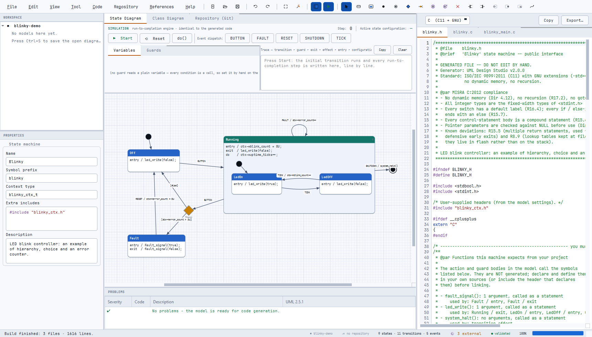
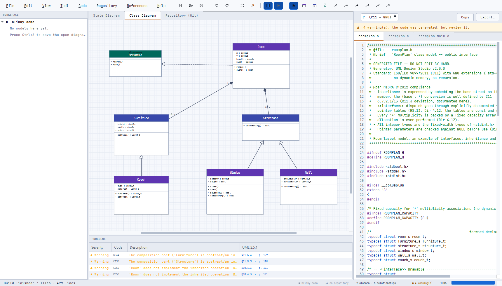
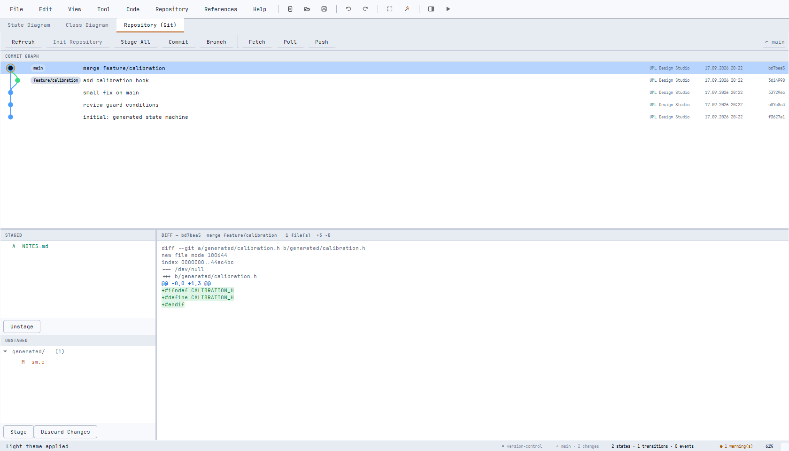

# UML Design Studio

Draw a UML 2.5.1 **state machine** or **class diagram**, press **Build**, and get
MISRA-aware **C11 / C++11** you can drop straight into an MCU project — plus a
working integration example, a simulator, and built-in version control.



---

## Why this exists

On most embedded projects the state machine lives in two places: a diagram in a
design document, and a hand-written `switch` statement in firmware. The moment
someone fixes a bug in the code, the diagram becomes a lie — and the next person
to read it is misled.

This tool removes the second copy. **The diagram is the source.** The firmware is
generated from it, deterministically, so the two can never drift apart. Along the
way you get things that are tedious to do by hand: correct hierarchical
run-to-completion semantics, history and choice/junction handling, MISRA-conscious
output, and a model that can be reviewed in a diff like any other source file.

---

## For embedded engineers

You keep writing firmware the way you already do. The tool only replaces the
state-machine or class skeleton.

**1 — Model your logic.** States, transitions, guards and actions. Guard and
action bodies are plain C/C++ expressions that call *your* functions.

**2 — Point it at your context.** In model settings you give a **context type**
(e.g. `blinky_ctx_t`) and any `#include`s. Inside every entry/exit/do/guard/effect
body, `ctx` (your struct) and `me` / `this` (the machine instance) are available:

```c
entry   /  ctx->blink_count = 0U;
guard   [  ctx->error_count > 3U  ]
effect  /  ctx->error_count++;
```

**3 — Build (F5).** You get `blinky.h`, `blinky.c` and a `blinky_main.c`
integration template. Add the first two to your build; the template shows the
wiring and is yours to throw away.

**4 — Drive it from your super-loop or RTOS task:**

```c
blinky_t sm;
blinky_ctx_t ctx = {0};

blinky_ctor(&sm, &ctx);
blinky_start(&sm);                          /* initial transition + entry */
blinky_dispatch(&sm, BLINKY_EVENT_BUTTON);  /* run-to-completion          */
blinky_do(&sm);                             /* doActivity chain           */
blinky_is_in(&sm, BLINKY_STATE_RUNNING);    /* includes parent states     */
```

```cpp
blinky::Blinky sm(&ctx);
sm.start();
sm.dispatch(blinky::Blinky::Event::Button);
```

**5 — Commit the model next to the code.** The generated files are byte-identical
for the same model, so a diff shows real design changes only.

The functions your actions call are **not** generated — they are listed for you in
the header, so a missing driver call is a compile error rather than a silent gap.

---

## What the generated code guarantees

* No dynamic memory, no recursion, no exceptions/RTTI
* All tables `static const` / `constexpr` — they live in flash, not RAM
* Reentrant: several instances of the same machine are fine
* Compiles clean under `-Wall -Wextra -pedantic -Werror -Wconversion -Wshadow`
* MISRA C:2012 / MISRA C++:2008 notes — including deliberate deviations —
  documented at the top of every generated file
* Doxygen comments on every function, in English
* Reproducible: no timestamps, same model → same bytes

---

## Install

### The short way

Download or clone the repository and run the launcher for your system:

```bash
run.bat        # Windows -- double-clicking it works too
./run.sh       # Linux / macOS  (chmod +x run.sh the first time)
```

On the **first run** it creates a private virtual environment in `.venv` next to
the launcher, installs PyQt6 into it, and starts the application. Every run after
that goes straight to the app. Nothing is installed system-wide, and deleting
`.venv` undoes all of it.

If something goes wrong the launcher says what and keeps the window open — you
only need the manual steps below when you want to control the environment
yourself.

### What you need

| | Package | Needed for |
|---|---|---|
| **Required** | Python 3 (developed on 3.13) | running the app |
| **Required** | `PyQt6` ≥ 6.5 | the entire user interface |
| Optional | `git` | the Repository tab; without it the tab explains that and everything else keeps working |
| Optional | `gcc` / `g++` | the test suite, which compiles the generated C/C++; skipped if absent |
| Optional | `pyinstaller` | building a standalone executable |

Only PyQt6 is a Python dependency — there is nothing else in `requirements.txt`.

### Platform support

The application itself is plain Python + PyQt6 and uses no OS-specific APIs
beyond a small "open this folder in the file manager" helper, which already has
Windows, macOS and Linux branches.

| Platform | Notes |
|---|---|
| **Windows 10 / 11** | Primary development platform; the launcher is tested from a clean checkout |
| **Linux** (X11 or Wayland) | Runs from source; see the Qt system libraries below |
| **macOS** | Runs from source |

The `run.sh` launcher is kept with LF line endings and the executable bit set
(see `.gitattributes`), so it stays runnable after a clone on either system.

Packaging is per-platform: PyInstaller builds a binary for the OS it runs on, so
a Windows `.exe` has to be built on Windows, a Linux binary on Linux.

### Windows — step by step

1. Install **Python 3** from [python.org](https://www.python.org/downloads/) and
   tick **"Add Python to PATH"** during setup.
2. *(Optional)* Install [Git for Windows](https://git-scm.com/download/win) to
   enable the Repository tab.
3. *(Optional)* Install a GCC toolchain — [MSYS2](https://www.msys2.org/) or
   MinGW-w64 — if you want to run the test suite.
4. In the project folder, create the environment and install the dependency:

   ```powershell
   python -m venv .venv
   .venv\Scripts\python.exe -m pip install --upgrade pip
   .venv\Scripts\python.exe -m pip install -r requirements.txt
   ```

5. Run it:

   ```powershell
   .venv\Scripts\python.exe main.py
   ```

   or just double-click **`run.bat`**, which finds the environment itself.

> If your Python came from the Microsoft Store, `pip install PyQt6` can fail
> because of path length. The in-project virtual environment above avoids it.

### Linux — step by step

1. Install Python, the venv module and the Qt runtime libraries. PyQt6 ships Qt
   itself in the wheel, but Qt still needs a few system libraries:

   **Debian / Ubuntu**

   ```bash
   sudo apt update
   sudo apt install -y python3 python3-venv python3-pip git build-essential \
       libgl1 libegl1 libfontconfig1 libdbus-1-3 libxkbcommon-x11-0 \
       libxcb-cursor0 libxcb-icccm4 libxcb-keysyms1 libxcb-shape0 \
       libxcb-randr0 libxcb-render-util0 libxcb-xinerama0
   ```

   **Fedora**

   ```bash
   sudo dnf install -y python3 python3-pip git gcc gcc-c++ \
       mesa-libGL mesa-libEGL fontconfig dbus-libs libxkbcommon-x11 \
       xcb-util-cursor xcb-util-wm xcb-util-keysyms xcb-util-renderutil
   ```

   **Arch**

   ```bash
   sudo pacman -S --needed python python-pip git base-devel \
       libglvnd fontconfig dbus libxkbcommon-x11 xcb-util-cursor \
       xcb-util-wm xcb-util-keysyms xcb-util-renderutil
   ```

   On a normal desktop install most of these are already present; `libxcb-cursor0`
   is the one Qt 6.5+ most often finds missing.

2. Create the environment and install the dependency:

   ```bash
   python3 -m venv .venv
   .venv/bin/python -m pip install --upgrade pip
   .venv/bin/python -m pip install -r requirements.txt
   ```

3. Run it:

   ```bash
   .venv/bin/python main.py
   ```

   or use the launcher:

   ```bash
   chmod +x run.sh
   ./run.sh
   ```

> On a headless machine or over plain SSH there is no display, and Qt will exit
> with `could not connect to display`. Use X11 forwarding (`ssh -X`), a desktop
> session, or a virtual display such as `xvfb-run`.

### macOS — step by step

1. Install Python 3 and git (via [Homebrew](https://brew.sh/), for example):

   ```bash
   brew install python git
   ```

2. Then exactly as on Linux:

   ```bash
   python3 -m venv .venv
   .venv/bin/python -m pip install --upgrade pip
   .venv/bin/python -m pip install -r requirements.txt
   .venv/bin/python main.py
   ```

## Building a standalone executable

Run the build script on the system you want the executable for:

```bash
build.bat        # Windows -- double-clicking it works too
./build.sh       # Linux / macOS  (chmod +x build.sh the first time)
```

It installs PyInstaller into the same `.venv`, packages the application and
prints where the result landed. The output is one self-contained file that runs
on a machine with **no Python and no PyQt6 installed** — the interpreter, Qt, the
GPL text and the sample diagram all travel inside it.

### One build per platform

PyInstaller is cross-platform but **not a cross-compiler**: it bundles the
interpreter and the Qt libraries *of the machine it runs on*. There is no flag
that builds a Windows `.exe` from Linux. To ship all three, run the script once
on each system.

| You build on | You get | Notes |
|---|---|---|
| **Windows** | `dist\UML-Design-Studio.exe` | One file, ~36 MB. Opens **no console window** — it is linked as a GUI binary — and carries the `.ico` icon plus the version resource Explorer shows under *Properties → Details*. |
| **Linux** | `dist/UML-Design-Studio` | One ELF file, already executable. No extension; run it as `./UML-Design-Studio`. The version resource and `.ico` are Windows-only ideas and are skipped. |
| **macOS** | `dist/UML Design Studio.app` | A real application bundle, so a double-click opens **no Terminal**. `dist/UML-Design-Studio`, the plain binary next to it, is for running from a terminal. |

### Two platform details worth knowing

**macOS quarantine.** A bundle you built yourself is unsigned, so Gatekeeper
refuses the first launch. Right-click the app and choose *Open* once, or clear
the flag:

```bash
xattr -dr com.apple.quarantine "dist/UML Design Studio.app"
```

**macOS icon.** The icon format differs per platform: Windows wants `.ico`,
macOS wants `.icns`. `tools/make_icon.py` draws the `.ico`; if you place a
`docs/app.icns` next to it, the spec picks it up automatically. Without one the
bundle simply gets the default icon — it is not an error.

### Where the console window went

A Qt application should never leave a black terminal behind it, and on each
system that is arranged differently:

* **Windows** — the packaged `.exe` is built with `console=False`, and `run.bat`
  starts the app through `pythonw.exe` (the windowed interpreter) and then exits,
  so no window is left over.
* **macOS** — a bare Unix binary opens a Terminal when double-clicked; only the
  `.app` bundle launches as a normal application, which is why the spec adds one.
* **Linux** — a binary started from a file manager has no terminal to begin with.
  Started from a shell it uses that shell, which is what you asked for by typing
  the command.

---

## The interface

At start-up the application asks for a **workspace** — the folder that holds
your models, the generated code and the git repository. Folders you have opened
before are offered as a list; `Forget selected` and `Clear list` take an entry
off it without touching the folder itself, so a project you no longer want
announced on every start does not have to stay there.

The window is one workspace with three tabs — **State Diagram**, **Class Diagram**
and **Repository (Git)** — and four working areas:

* **Left** — the `WORKSPACE` tree (every model in the folder and everything inside
  it) and `PROPERTIES` for the selected element.
* **Centre** — the canvas, with the **SIMULATION** strip above it: `Start`,
  `Reset`, `do()`, one button per event, live guard switches, and a step-by-step
  run-to-completion trace.
* **Right** — the generated sources, one tab per file, with a language selector
  (C / C++ / PlantUML), `Copy` and `Export…`.
* **Bottom** — `PROBLEMS`. Every finding cites the **UML 2.5.1 clause and page**
  it comes from, and clicking a row selects the offending element on the canvas.

Validation runs continuously as you edit; code is written to disk only on
**Build** (`F5`), so dragging things around never touches the filesystem.

Useful keys: `F5` build · `F7` validate · `F8` repository · `F9` code panel ·
`F10` simulation · `F1` all shortcuts.

### State diagrams

The default mode, and the one in the screenshot at the top of this page. You get
the full UML 2.5.1 vocabulary — **State**, **Composite State**, **Initial**,
**Final**, **Choice**, **Junction**, **Shallow History** (H), **Deep History**
(H\*) and **Terminate**, with external, internal and local transitions — compiled
into a table-driven hierarchical state machine.

Each tool has a one-key shortcut: `S` state · `G` composite · `I` initial ·
`F` final · `C` choice · `J` junction · `H` history · `D` deep history ·
`X` terminate · `T` transition (click source, then target) · `V` back to select.
Drop a state inside a composite and the hierarchy updates itself.

The parts that are easy to get wrong by hand are exactly the parts the generator
handles for you:

| | Behaviour |
|---|---|
| **Junction** | *Static* branch — guards are evaluated **before** leaving the source state |
| **Choice** | *Dynamic* branch — guards are evaluated **after** the transition's effect has run |
| **History** | Restores the last active substate; cleared when the region completed through a final state |
| **Terminate** | The machine exits no state, so no exit actions run, and nothing executes afterwards |
| **Completion** | A composite completes only when **its own** region reaches a final state |
| **`else`** | Always tried last, whatever priority it was given |

Each of these is pinned down by a test that quotes the clause of the
specification it comes from.

### Class diagrams

Classes, abstract classes and `«interface»`, with association, aggregation,
composition, generalization, realization and dependency — generating struct +
vtable C, or C++ with virtual dispatch.



### Version control, built in

The third tab is a git client scoped to your workspace: commit graph with
branches and merges, staging area, and a unified diff — so the model and the
firmware it produced are committed together.



---

## Simulation and validation

The simulator runs your diagram **before** any code is generated, using the same
intermediate representation and the same algorithm as the generators — equivalence
is re-checked on every test run, so what you see on the canvas is what the
firmware will do.

Validation knows the symbols the generator will actually emit, so name collisions
(`LedOn` vs `Led_On` landing on the same constant) are reported as errors instead
of becoming a broken build.

---

## Tests

```bash
# Windows
.venv\Scripts\python.exe tools\check_all.py

# Linux / macOS
.venv/bin/python tools/check_all.py
```

The suite generates code, compiles it with `-Werror`, runs it, and compares the
behaviour trace against a Python reference and a fuzz run. It also checks UML
2.5.1 conformance clause by clause, the full feature surface through the real UI,
and the workspace/git layer against real temporary repositories. Steps that need
`gcc`/`g++` or `git` are skipped, not failed, when those are missing.

---

## Project layout

```
main.py                 entry point
run.bat / run.sh        launchers      (Windows / Linux + macOS)
build.bat / build.sh    build scripts  (Windows / Linux + macOS)
UML-Design-Studio.spec  one PyInstaller recipe, branching per platform
app/core/               model, validation, simulation, workspace, git   (no Qt)
app/codegen/            C / C++ / PlantUML generators
app/ui/                 canvas, panels, dialogs, theme
examples/               blinky.usm + compilable support files
tools/                  tests, verification, packaging helpers
```

---

## Status and feedback

Version 2.0.0. This tool was developed with the help of **Claude (Anthropic)**,
and while it is backed by a fairly thorough automated test suite, it is a young
project and bugs are absolutely possible — in the UI, in the generated code, or in
a corner of the UML semantics.

If you run into one, please open an issue with the model file and what you
expected to happen. Bug reports, debugging notes and pull requests are genuinely
welcome and nothing will be taken personally — a reported problem is far more
useful than a silent workaround.

---

## References and license

The **References** menu inside the app lists the sources this tool is built on:
OMG UML 2.5.1, MISRA C:2012, MISRA C++:2008 / AUTOSAR C++14, ISO C11 / C++11,
Samek's table-driven HSM approach, GoF *Design Patterns*, and Douglass's *Design
Patterns for Embedded Systems in C*.

Licensed under the **GNU General Public License v3** — full text in
[LICENSE](LICENSE), and in the app under **Help → License**.
